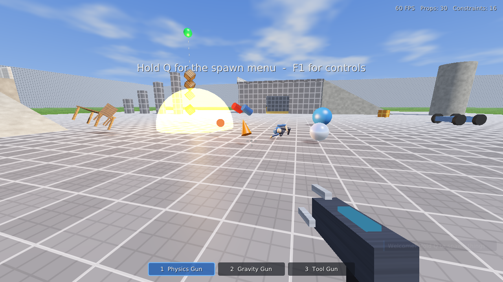
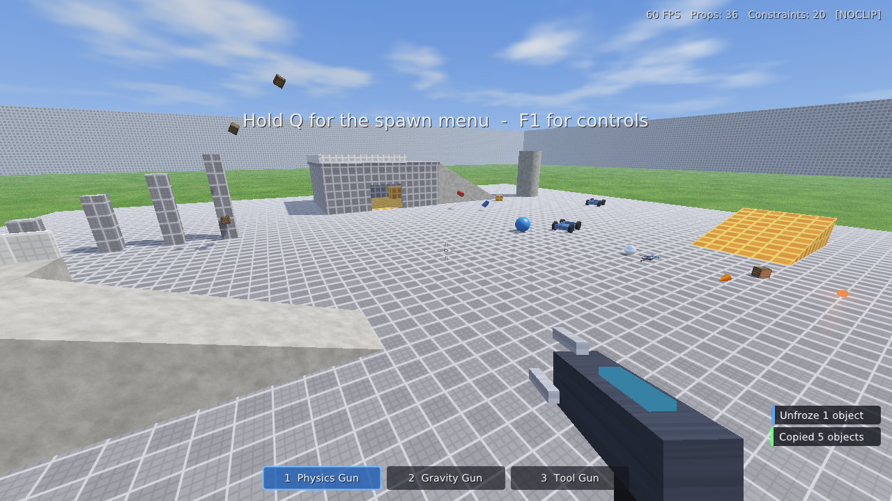
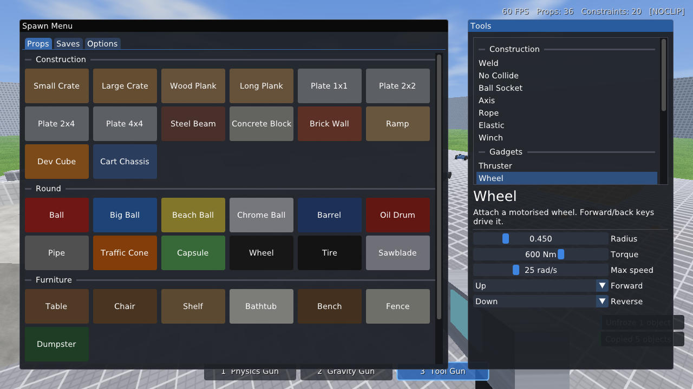

# Better GMod Clone

A 3D physics sandbox in the spirit of Garry's Mod, written in C++17 for Linux.
Spawn props and ragdolls, throw them around with the Physics Gun, and build
contraptions with the Tool Gun: welds, hinges, ropes, wheels, thrusters,
balloons, hoverballs, dynamite and more.

All content is procedural: meshes, textures, sounds and the map are generated
in code, so there are no asset files to download.





## Building

Dependencies: a C++17 compiler, CMake ≥ 3.16, SDL2, Bullet Physics, GLM and an
OpenGL 3.3 driver. Dear ImGui is vendored in `third_party/`.

```sh
# Debian / Ubuntu
sudo apt install build-essential cmake libsdl2-dev libbullet-dev libglm-dev
# Fedora
sudo dnf install gcc-c++ cmake SDL2-devel bullet-devel glm-devel
# Arch
sudo pacman -S base-devel cmake sdl2 bullet glm

cmake -S . -B build -DCMAKE_BUILD_TYPE=Release
cmake --build build -j$(nproc)
./build/gmodclone
```

Options: `--width W --height H`, `--fullscreen`, and `--autotest` (see below).

## Controls

| Key | Action |
| --- | --- |
| W A S D, Space, Ctrl, Shift | Move, jump, crouch, sprint |
| 1 / 2 / 3 or mouse wheel | Physics Gun / Gravity Gun / Tool Gun |
| Q (hold, or tap to keep open) | Spawn menu, tool list and tool settings |
| Z (hold to repeat) | Undo |
| V | Noclip |
| F5 / F9 | Quick save / quick load |
| F12 | Screenshot |
| F1 | Controls overlay |
| Esc | Pause menu |

**Physics Gun:** left click grabs an object. Scroll pushes it away or pulls it
closer, E + mouse rotates it (hold Shift to snap to 45°), and right click
freezes it in place. R unfreezes the whole contraption you're aiming at.

**Gravity Gun:** right click pulls in, picks up or drops objects. Left click
punts or launches them.

**Tool Gun:** the panel in the top-left shows what left click, right click and
R do for the current tool. Pick tools and change their settings in the Q menu.

## Features

- **Physics:** Bullet rigid bodies with boxes, spheres, cylinders, capsules,
  cones, wedges, tori and compound props. CCD for fast objects and impact
  sounds scaled by impulse.
- **About 40 spawnable props:** crates, planks, plates, beams, barrels, balls,
  wheels, furniture, a cart chassis, glow lamps, balloons, dynamite, and
  **ragdolls** (11 bodies, cone-twist and hinge joints).
- **Tools:**
  - Construction: Weld, No Collide, Ball Socket, Axis, Rope, Elastic, Winch
  - Gadgets: Thruster, Wheel (motorised), Hoverball, Balloon, Dynamite, Lamp
  - Utility: Remover, Weight, Duplicator
  - Render: Colour, Material
- **Freeze and unfreeze**, undo history, and **save/load** to
  `~/.local/share/better-gmod-clone/saves`. The Duplicator copies and pastes
  whole contraptions using the same format.
- **Map:** a construct-style map with a building, a roof ramp, a tower, a car
  jump, pillars and boundary walls.
- **Rendering:** OpenGL 3.3 forward renderer with procedural materials (dev
  grid, wood, crate, metal, concrete, grass, brick, chrome and more), shadow
  mapping with PCF, up to 16 dynamic point lights, a sky with clouds, fog,
  glowing beams, explosions and viewmodels.
- **Audio:** a small software mixer with procedurally synthesised sounds:
  impacts, tool gun zaps, explosions, the physgun hum and thrusters.
- **UI:** a GMod-style spawn menu, tool panel, notifications and pause menu,
  built with Dear ImGui.

## Self-test

`--autotest` runs a scripted session. It builds a scene with the real tools,
drives a car with motorised wheels, detonates dynamite, uses the Physics Gun
with simulated mouse input, then checks save/load, duplication and undo. It
prints a pass/fail line for each step and saves screenshots. The exit code is
non-zero on failure. It also works headless:

```sh
SDL_AUDIODRIVER=dummy xvfb-run -a -s "-screen 0 1280x720x24" \
  ./build/gmodclone --width 1280 --height 720 --autotest --shots /tmp
```

## Code layout

| File | Purpose |
| --- | --- |
| `src/game.*` | Window, main loop, input routing, save/load glue, autotest |
| `src/world.*` | Props, constraints, attachments, ragdolls, map, undo, serialisation |
| `src/weapons.*` | Physics Gun, Gravity Gun, Tool Gun, viewmodels |
| `src/tools.cpp` | Every tool gun mode |
| `src/player.*` | First-person character controller and noclip |
| `src/renderer.*` | Shaders, shadow map, sky, beams |
| `src/physics.*` | Bullet world wrapper, ray and sweep queries |
| `src/assets.*` | Prop catalogue, procedural meshes and collision shapes |
| `src/audio.*` | Procedural sound synthesis and mixing |
| `src/ui.*` | HUD, spawn menu, pause menu, help |
