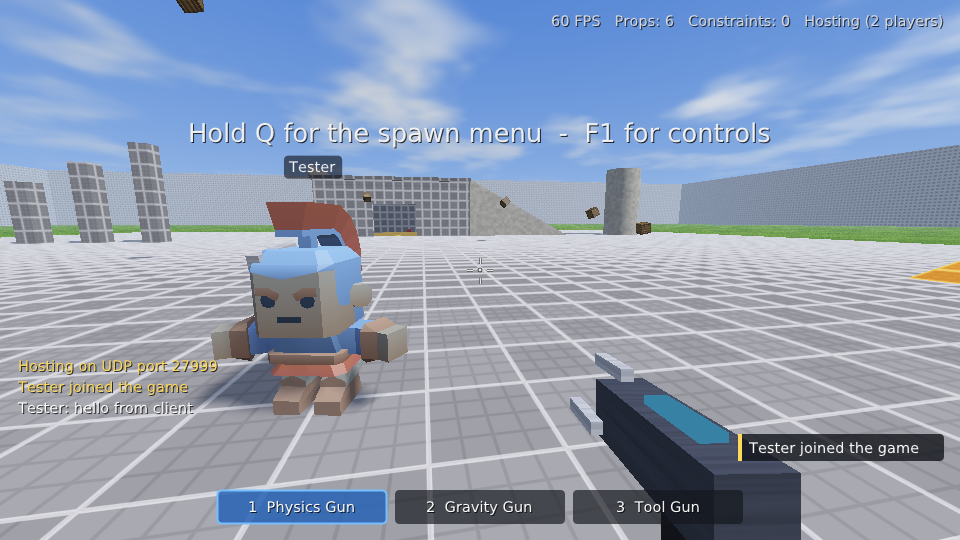
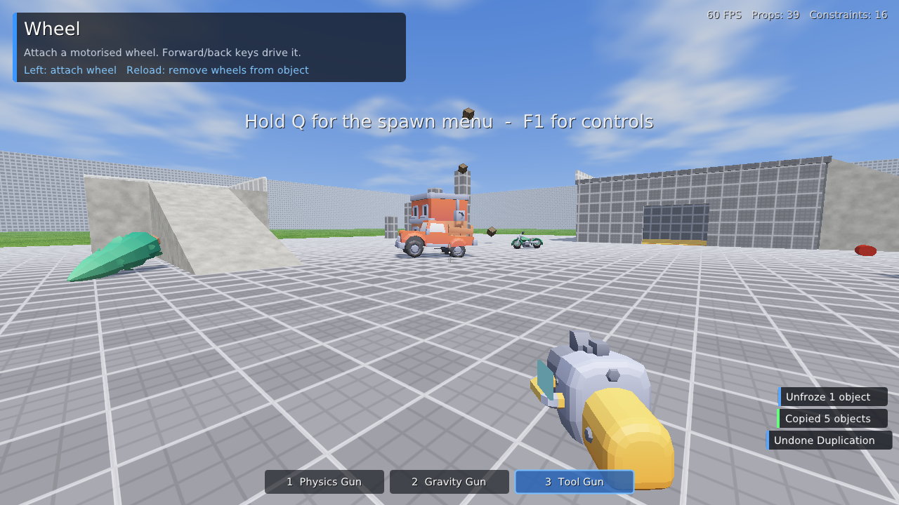

# Better GMod Clone

A 3D physics sandbox in the spirit of Garry's Mod, written in C++17 for Linux.
Spawn props, models and ragdolls, throw them around with the Physics Gun, and
build contraptions with the Tool Gun: welds, hinges, ropes, wheels, thrusters,
balloons, hoverballs, dynamite and more. Play alone or with friends over the
network.






## Building

Dependencies: a C++17 compiler, CMake ≥ 3.16, SDL2, Bullet Physics, GLM and an
OpenGL 3.3 driver. Dear ImGui, ENet and stb_vorbis are vendored in `third_party/`.

```sh
# Debian / Ubuntu
sudo apt install build-essential cmake libsdl2-dev libbullet-dev libglm-dev
# Fedora
sudo dnf install gcc-c++ cmake SDL2-devel bullet-devel glm-devel
# Arch
sudo pacman -S base-devel cmake sdl2 bullet glm

cmake -S . -B build -DCMAKE_BUILD_TYPE=Release
cmake --build build -j$(nproc)
./build/gmodclone
```

Run it from anywhere: the game finds `assets/` next to the binary, one level
up, in the source tree it was built from, or in `$GMODCLONE_ASSETS`.
`cmake --install build` puts the binary in `bin/` and the assets in
`share/better-gmod-clone/`. Without the asset folder the game still runs, using
only procedural props and synthesised sounds.

Options: `--width W --height H`, `--fullscreen`, `--name NAME`,
`--host [PORT]`, `--connect HOST[:PORT]`, and `--autotest` (see below).

## Multiplayer

- **Host:** open the Q menu, go to the **Multiplayer** tab and press **Start
  hosting**, or run `./build/gmodclone --host` (UDP port 27015 by default).
- **Join:** enter the host's address in the same tab, or run
  `./build/gmodclone --connect 192.168.1.20`. Use `host:port` for another port.
- **Internet play:** forward the UDP port on the host's router.

The host runs the physics simulation. Every client gets its own Physics Gun,
Gravity Gun and Tool Gun on the server, with that client's tool settings, so
all tools work online. Undo is per player, and thruster, wheel and dynamite
keys work for whoever presses them. Props are streamed to clients as 30 Hz
snapshots and interpolated. Spawns, constraint changes, sounds, explosions,
notifications and chat are all replicated. Press **T** or **Enter** to chat.
Only the host can save, load or change physics settings. Networking uses
[ENet](https://github.com/lsalzman/enet), vendored in `third_party/enet`.

## Controls

| Key | Action |
| --- | --- |
| W A S D, Space, Ctrl, Shift | Move, jump, crouch, sprint |
| 1 / 2 / 3 or mouse wheel | Physics Gun / Gravity Gun / Tool Gun |
| Q (hold, or tap to keep open) | Spawn menu, tool list and tool settings |
| Z (hold to repeat) | Undo |
| V | Noclip |
| F5 / F9 | Quick save / quick load |
| F12 | Screenshot |
| F1 | Controls overlay |
| T / Enter | Chat |
| Esc | Pause menu |

**Physics Gun:** left click grabs an object. Scroll pushes it away or pulls it
closer, E + mouse rotates it (hold Shift to snap to 45°), and right click
freezes it in place. R unfreezes the whole contraption you're aiming at.

**Gravity Gun:** right click pulls in, picks up or drops objects. Left click
punts or launches them.

**Tool Gun:** the panel in the top-left shows what left click, right click and
R do for the current tool. Pick tools and change their settings in the Q menu.

## Assets

Imported models and sound effects come from [Kenney](https://kenney.nl)'s
CC0 (public domain) starter kits on GitHub: trucks, a motorcycle, a drone,
houses, a fountain, statues, columns, trees, stairs, walls, weapons,
characters and more. Sounds include impacts, spawn and undo clicks, the tool
gun, explosions, a vehicle engine, footsteps and ambience. Credits are in
`assets/LICENSE.md`.

`tools/fetch_assets.sh` downloads the kits and rebuilds `assets/`. It needs
`pip install trimesh numpy scipy`. The models are converted by
`tools/convert_models.py` into a compact `.gmd` format with textures baked into
vertex colours. To add a model, add a line to `tools/models.txt` and an entry
in the catalogue in `src/assets.cpp`. Models get convex-hull collision
automatically.

Every spawn menu button shows a 3D render of its prop. These icons are drawn
off-screen at startup by the renderer.

## Features

- **Physics:** Bullet rigid bodies with boxes, spheres, cylinders, capsules,
  cones, wedges, tori and compound props. CCD for fast objects and impact
  sounds scaled by impulse.
- **About 75 spawnable props:** crates, planks, plates, beams, barrels, balls,
  wheels, furniture, a cart chassis, glow lamps, balloons, dynamite,
  **ragdolls** (11 bodies, cone-twist and hinge joints), and 37 imported
  models with rendered spawn icons.
- **Tools:**
  - Construction: Weld, No Collide, Ball Socket, Axis, Rope, Elastic, Winch
  - Gadgets: Thruster, Wheel (motorised), Hoverball, Balloon, Dynamite, Lamp
  - Utility: Remover, Weight, Duplicator
  - Render: Colour, Material
- **Freeze and unfreeze**, undo history, and **save/load** to
  `~/.local/share/better-gmod-clone/saves`. The Duplicator copies and pastes
  whole contraptions using the same format.
- **Map:** a construct-style map with a building, a roof ramp, a tower, a car
  jump, pillars and boundary walls.
- **Rendering:** OpenGL 3.3 forward renderer with procedural materials (dev
  grid, wood, crate, metal, concrete, grass, brick, chrome and more), shadow
  mapping with PCF, up to 16 dynamic point lights, a sky with clouds, fog,
  glowing beams, explosions and viewmodels.
- **Audio:** a small software mixer that plays the CC0 sound effects (OGG,
  decoded with stb_vorbis) with random variants. It falls back to procedurally
  synthesised sounds and adds a synthesised physgun hum and explosion rumble.
- **UI:** a GMod-style spawn menu, tool panel, notifications and pause menu,
  built with Dear ImGui.

## Self-tests

`--autotest` runs a scripted single-player session. It builds a scene with the real tools,
drives a car with motorised wheels, detonates dynamite, uses the Physics Gun
with simulated mouse input, then checks save/load, duplication and undo. It
prints a pass/fail line for each step and saves screenshots. The exit code is
non-zero on failure. It also works headless:

```sh
SDL_AUDIODRIVER=dummy xvfb-run -a -s "-screen 0 1280x720x24" \
  ./build/gmodclone --width 1280 --height 720 --autotest --shots /tmp
```

`tools/net_selftest.sh` starts a host and a client and plays them against each
other. The client joins, spawns a prop, lifts a crate with the Physics Gun,
places dynamite with the Tool Gun and detonates it, then chats with the host.
Both processes check that everything replicated. CI runs both tests on every
push.

## Code layout

| File | Purpose |
| --- | --- |
| `src/game.*` | Window, main loop, input routing, save/load glue, autotest |
| `src/world.*` | Props, constraints, attachments, ragdolls, map, undo, serialisation |
| `src/weapons.*` | Physics Gun, Gravity Gun, Tool Gun, viewmodels |
| `src/tools.cpp` | Every tool gun mode |
| `src/player.*` | First-person character controller and noclip |
| `src/renderer.*` | Shaders, shadow map, sky, beams |
| `src/physics.*` | Bullet world wrapper, ray and sweep queries |
| `src/assets.*` | Prop catalogue, procedural meshes, model loading, collision shapes |
| `src/audio.*` | OGG loading, sound synthesis and mixing |
| `src/ui.*` | HUD, spawn menu, multiplayer tab, chat, name tags, pause menu, help |
| `src/net.*` | Multiplayer: protocol, host replication, client interpolation |
| `tools/` | Asset fetch/convert scripts, multiplayer self-test |
| `assets/` | Kenney CC0 models (`.gmd`) and sounds (`.ogg`) |
